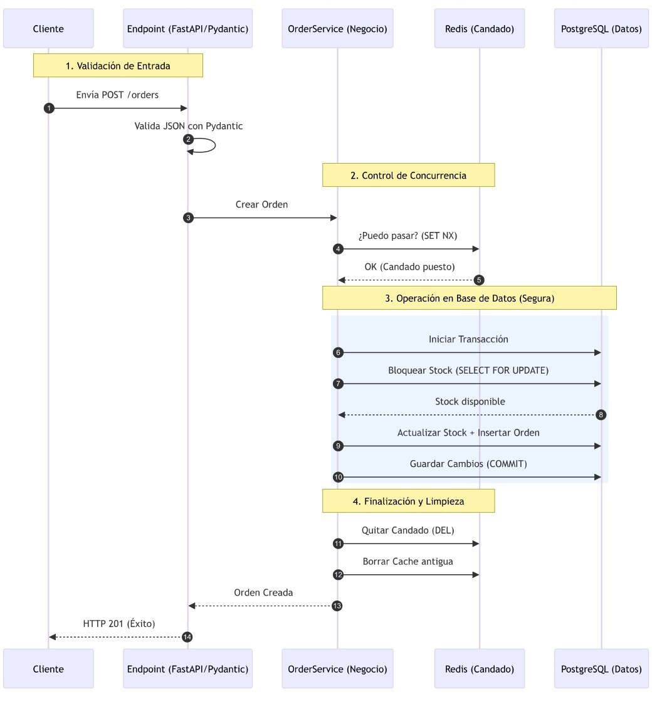
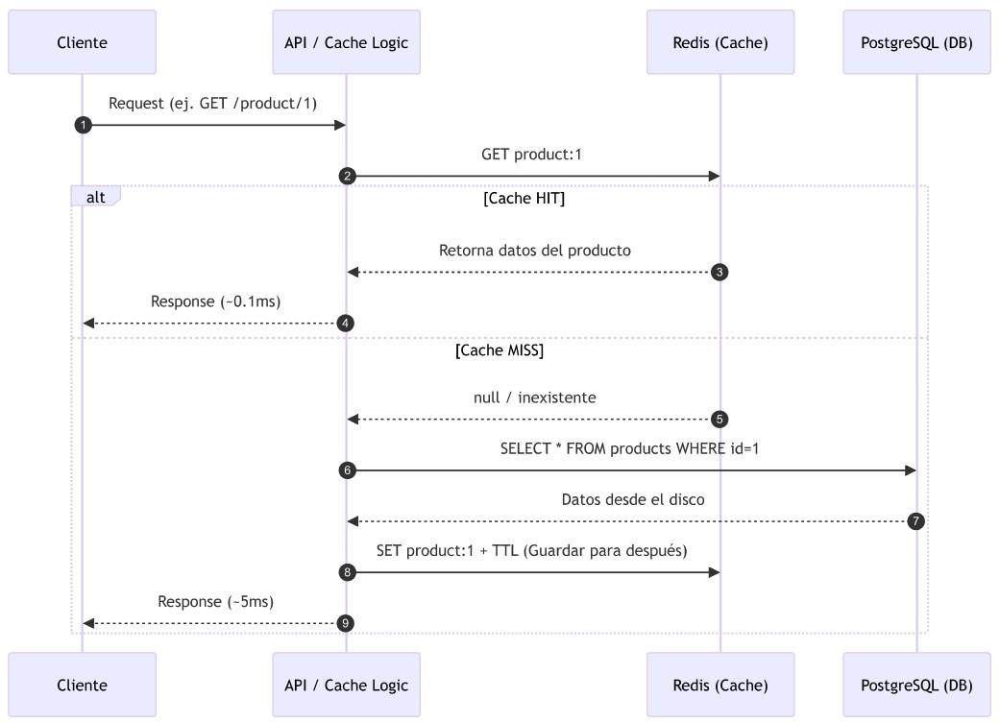
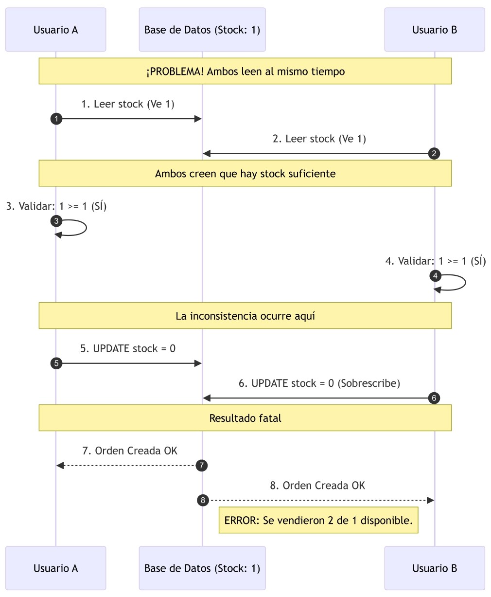
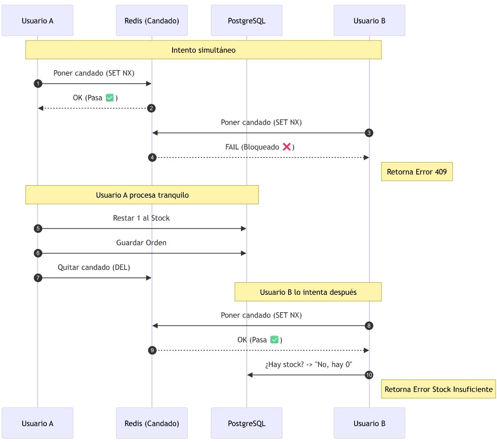

# Arquitectura del Sistema

## Documento de Diseño Arquitectonico

**Proyecto:** Sistema Backend - Gestion de Productos, Ordenes y Reportes de Ventas

**Fecha:** 14 de febrero de 2026

**Autor:** Jamid Stiven Villarreal Rugeles

**Arquitectura:** Hexagonal (Ports & Adapters)

## Requerimientos Técnicos

**Lenguaje:** Python

**Framework:** FastAPI

**Base de datos:** PostgreSQL

**ORM:** SQLAlchemy

**Redis:** redis

**Validaciones:** Pydantic

**Manejo correcto de errores HTTP**

**Control de transacciones**

---

## Tabla de Contenidos

1. [Diagrama de Flujo del Sistema](#1-diagrama-de-flujo-del-sistema)
2. [Componentes Principales](#2-componentes-principales)
3. [Justificacion del Stack Tecnologico](#3-justificacion-del-stack-tecnologico)
4. [Flujo de Creacion de Ordenes](#4-flujo-de-creacion-de-ordenes)
5. [Uso de Redis](#5-uso-de-redis)
6. [Estrategia de Escalabilidad](#6-estrategia-de-escalabilidad)

---

## 1. Diagrama de Flujo del Sistema

### 1.1 Arquitectura general


### 1.2 Flujo de una Request HTTP


## 2. Componentes Principales

### 2.1 API Backend (FastAPI)

FastAPI actua como el adaptador primario de entrada en la arquitectura hexagonal.

#### Estructura Hexagonal del proyecto

```text
app/
├── main.py                          # Entry point
├── api/                             # ADAPTERS IN
│   ├── v1/endpoints/
│   │   ├── products.py
│   │   ├── orders.py
│   │   └── reports.py
│   ├── dependencies.py              # Inyeccion de dependencias
│   └── middleware/
│       ├── rate_limiter.py
│       ├── logging_middleware.py
│       └── error_handler.py
├── domain/                          # NUCLEO DEL HEXAGONO
│   ├── models/
│   │   ├── product.py
│   │   └── order.py
│   ├── services/
│   │   ├── product_service.py
│   │   ├── order_service.py
│   │   └── report_service.py
│   ├── ports/outbound/
│   │   ├── product_repository_port.py
│   │   ├── order_repository_port.py
│   │   └── cache_port.py
│   └── exceptions.py
├── infrastructure/                  # ADAPTERS OUT
│   ├── database/
│   │   ├── connection.py
│   │   ├── models/
│   │   └── repositories/
│   └── cache/
│       ├── redis_client.py
│       └── redis_cache_adapter.py
├── schemas/                         # Pydantic DTOs
└── core/
    ├── config.py
    └── logging.py
```

#### Responsabilidades de cada capa

| Capa                             | Responsabilidad                                   | Depende de              |
| -------------------------------- | ------------------------------------------------- | ----------------------- |
| `api/` (Adapters In)             | Recibir HTTP, validar entrada, devolver responses | `domain/ports`          |
| `domain/ports/`                  | Definir contratos (interfaces abstractas)         | Nada                    |
| `domain/services/`               | Logica de negocio, reglas, orquestacion           | `domain/ports/outbound` |
| `domain/models/`                 | Entidades del negocio con invariantes             | Nada                    |
| `infrastructure/` (Adapters Out) | Acceso a datos, cache, servicios externos         | `domain/ports/outbound` |
| `schemas/`                       | DTOs de entrada/salida (Pydantic)                 | Nada                    |

**Regla de dependencia:** Las flechas siempre apuntan hacia el dominio. La infraestructura depende del dominio, nunca al reves.

### 2.2 Base de Datos Relacional (PostgreSQL)

#### Modelo Entidad-Relacion


#### Estados de una orden


### 2.3 Redis

| Funcion                | Patron de clave                | TTL    | Proposito                        |
| ---------------------- | ------------------------------ | ------ | -------------------------------- |
| **Cache de productos** | `product:{id}`                 | 5 min  | Evitar queries repetitivos       |
| **Cache de listados**  | `products:list:{skip}:{limit}` | 2 min  | Acelerar listados paginados      |
| **Cache de reportes**  | `report:{type}:{params_hash}`  | 10 min | Reportes costosos pre-calculados |
| **Rate Limiting**      | `rate:{client_ip}`             | 1 min  | Control de abuso                 |
| **Locks distribuidos** | `lock:stock:{product_id}`      | 30 seg | Concurrencia en stock            |

### 2.4 Capa de Autenticacion


## 3. Justificacion del Stack Tecnologico

### 3.1 Framework: FastAPI

| Criterio              | FastAPI             | Flask          | Django REST     |
| --------------------- | ------------------- | -------------- | --------------- |
| **Rendimiento**       | Alto (async nativo) | Medio (sync)   | Medio           |
| **Validacion**        | Pydantic integrado  | Manual         | DRF Serializers |
| **Docs auto**         | OpenAPI/Swagger     | Manual         | Browsable API   |
| **Async nativo**      | Si                  | Limitado       | Limitado        |
| **Inyeccion de deps** | Built-in (Depends)  | Flask-Injector | Limitado        |

**Decision:** FastAPI

1. **Async nativo** para manejar miles de conexiones concurrentes.
2. **Pydantic integrado** valida cada request antes de la logica de negocio.
3. **Swagger auto-generado** desde type hints, acelera integracion con frontend.
4. **`Depends()`** facilita la arquitectura hexagonal al inyectar repositorios y servicios.
5. **Rendimiento** comparable a Node.js/Go (basado en Starlette + Uvicorn ASGI).

### 3.2 Base de Datos: PostgreSQL

| Criterio               | PostgreSQL                  | MySQL      | SQLite          |
| ---------------------- | --------------------------- | ---------- | --------------- |
| **Transacciones ACID** | Completo                    | Completo   | Parcial         |
| **Concurrencia**       | MVCC avanzado               | Lock-based | Lock global     |
| **Escalabilidad**      | Read replicas, partitioning | Buena      | Solo desarrollo |

**Decision:** PostgreSQL

1. **MVCC:** Lecturas no bloquean escrituras. Reportes corren mientras se procesan ordenes.
2. **`SELECT FOR UPDATE`:** Lock a nivel de fila para proteger stock en ordenes.
3. **DECIMAL:** Sin errores de punto flotante en precios.
4. **Escalabilidad:** Read replicas + PgBouncer para alta concurrencia.

### 3.3 ORM: SQLAlchemy (Async)

| Criterio        | SQLAlchemy | SQLModel | Tortoise |
| --------------- | ---------- | -------- | -------- |
| **Madurez**     | 20+ anos   | Reciente | Medio    |
| **Async**       | Si (v2.0+) | Parcial  | Nativo   |
| **Migraciones** | Alembic    | Alembic  | Aerich   |

**Decision:** SQLAlchemy 2.0+

1. **AsyncSession** se integra con el event loop de FastAPI sin bloquear.
2. **Unit of Work:** Control fino de transacciones para atomicidad en ordenes.
3. **Alembic:** Migraciones versionadas y reversibles.

### 3.4 Redis: Por que y Para que

| Rol               | Problema sin Redis                                             | Solucion con Redis                                                      |
| ----------------- | -------------------------------------------------------------- | ----------------------------------------------------------------------- |
| **Cache**         | 1000 req/s, cada una query a PostgreSQL. DB se satura.         | `GET product:123` en ~0.1ms vs ~5ms de PostgreSQL.                      |
| **Concurrencia**  | Dos usuarios compran el ultimo item. Stock queda negativo.     | `SET lock:stock:456 NX EX 30` — lock atomico distribuido.               |
| **Rate Limiting** | Cliente abusivo con 10K req/s degrada el servicio.             | `INCR rate:ip` con TTL 60s. HTTP 429 si excede limite.                  |
| **Reportes**      | Query de ventas escanea 100K registros. 50 usuarios = 5M rows. | Primer request cachea el resultado. Siguientes 49 lo obtienen en 0.1ms. |

**Driver:** `redis.asyncio` para integracion nativa con el event loop.

## 4. Flujo de Creacion de Ordenes

### 4.1 Diagrama de Secuencia



### 4.2 Descripcion Paso a Paso

**Fase 1 - Validacion de Entrada:** Nos aseguramos de que lo que envía el usuario tenga sentido antes de gastar recursos de base de datos.

1. Envío del Request: El Cliente hace una petición POST /orders.
2. Validación Pydantic: El Endpoint utiliza Pydantic para verificar que el JSON traiga los campos correctos. Si esto falla, el proceso muere aquí con un error 422, protegiendo al resto del sistema.

**Fase 2 - Control de Concurrencia(Lock):** Aquí evitamos el problema de las peticiones duplicadas o colisiones de milisegundos.

3. Llamada al Servicio: El endpoint le pasa la responsabilidad al OrderService, que contiene la lógica de negocio.
4. SET NX en Redis: El servicio intenta poner un "candado" en Redis usando una operación llamada SET NX (Set if Not Exists).
5. Confirmación: Si Redis responde OK, significa que nadie más está procesando esta orden específica en este momento. Es nuestra garantía de exclusividad.

**Fase 3: Operación en Base de Datos (Transaccion):** Esta es la parte más crítica. Se ejecuta dentro de una transacción para que, si algo falla, no se guarde nada a medias.

6.  Inicio de Transacción: Se abre una conexión segura con PostgreSQL.
7.  Bloqueo Pesimista (SELECT FOR UPDATE): El servicio consulta el stock del producto pero le dice a la DB: "No dejes que nadie más lea o toque este stock hasta que yo termine". Esto evita que dos personas compren el último artículo al mismo tiempo.
8.  Verificación: La DB confirma que hay stock disponible.
9.  Escritura: Se resta el stock y se inserta la nueva orden con sus detalles.
10. COMMIT: Se confirma la operación. En este punto, los cambios son permanentes y visibles para todos.

**Fase 4: Finalización y Limpieza**

11. Quitar Candado: Se borra la llave en Redis (DEL) para que el sistema quede libre para futuras operaciones relacionadas.
12. Invalidar Cache: Si tenías una lista de productos en caché, ahora su stock es viejo. Se borra esa caché para forzar que la próxima vez se lea el dato nuevo de la DB.
13. Respuesta Interna: El servicio confirma al endpoint que todo salió bien.
14. Respuesta al Cliente: Se envía el HTTP 201 (Created). El usuario ve que su compra fue exitosa.

### 4.3 Tabla de errores

| Escenario          | Accion                            | HTTP |
| ------------------ | --------------------------------- | ---- |
| JSON invalido      | Pydantic rechaza                  | 422  |
| Producto no existe | ProductNotFoundError              | 404  |
| Stock insuficiente | InsufficientStockError + rollback | 409  |
| Lock no disponible | StockLockError + liberar locks    | 409  |
| Error de DB        | Rollback automatico + log         | 500  |
| Redis caido        | Degradacion: proceder sin lock    | 200  |

## 5. Uso de Redis

### 5.1 Cache de datos

#### Estrategia: Cache-Aside (Lazy Loading)



### 5.2 Manejo de Concurrencia

#### Problema: Race Condition en Stock



#### Solucion: Doble Barrera (Redis Lock + PostgreSQL FOR UPDATE)



### 5.3 Optimizacion de Reportes

#### Problema

El endpoint de reportes ejecuta una consulta pesada que:

- hace JOIN + COUNT(DISTINCT ...) + SUM(...)
- recorre muchas filas del mes
- puede tardar 2–5s y se repite muchas veces con los mismos parámetros

**Consulta base (costosa)**

```sql
SELECT
  p.category,
  COUNT(DISTINCT o.id) AS orders,
  SUM(oi.subtotal)     AS revenue
FROM orders o
JOIN order_items oi ON o.id = oi.order_id
JOIN products p     ON oi.product_id = p.id
WHERE o.created_at BETWEEN '2026-01-01' AND '2026-01-31'
GROUP BY p.category
ORDER BY revenue DESC;
```

**Impacto**

- Latencia alta para usuarios (segundos).
- Carga fuerte en PostgreSQL.
- Picos de tráfico = riesgo de saturar la DB.

**Objetivo**

- Responder reportes repetidos en ~milisegundos.
- Reducir carga en DB.
- Mantener datos “suficientemente frescos”.

#### Solucion

```
​GET /reports/sales?from=2026-01-01&to=2026-01-31
```

1. Generar la clave de cache

- hash = md5("sales:2026-01-01:2026-01-31")[:8] = a3f2b1c0
- Redis key final: report:sales:a3f2b1c0

2. Leer primero desde Redis (HIT/MISS)

- HIT (frecuente): retornar respuesta en ~0.1ms
- MISS: ejecutar query (2–5s), guardar en Redis con TTL=10 min, y retornar

3. Invalidación al cambiar datos (cuando se crea una orden)

Cuando se crea una orden (o se cancela / edita), se invalida el cache:

- simple: borrar “familia” de reportes report:sales:\*

## 6. Estrategia de Escalabilidad

TODO
