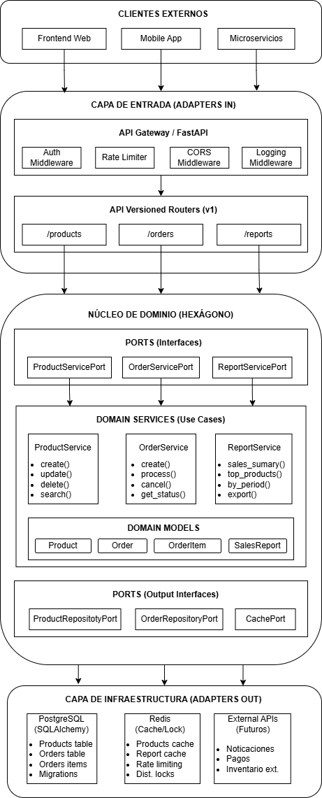
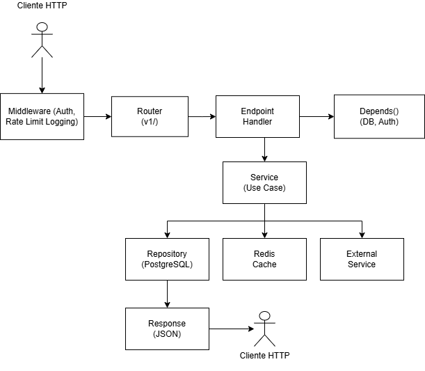
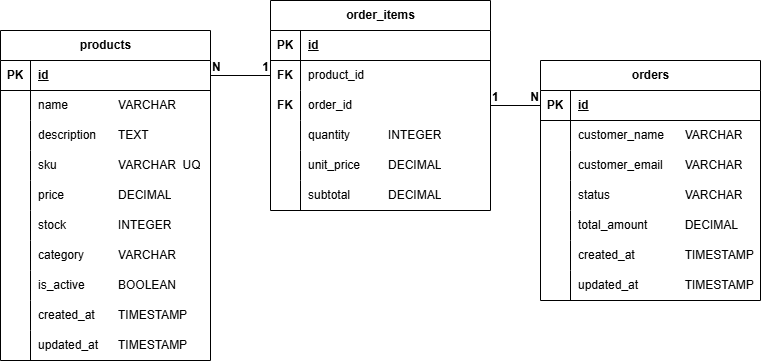
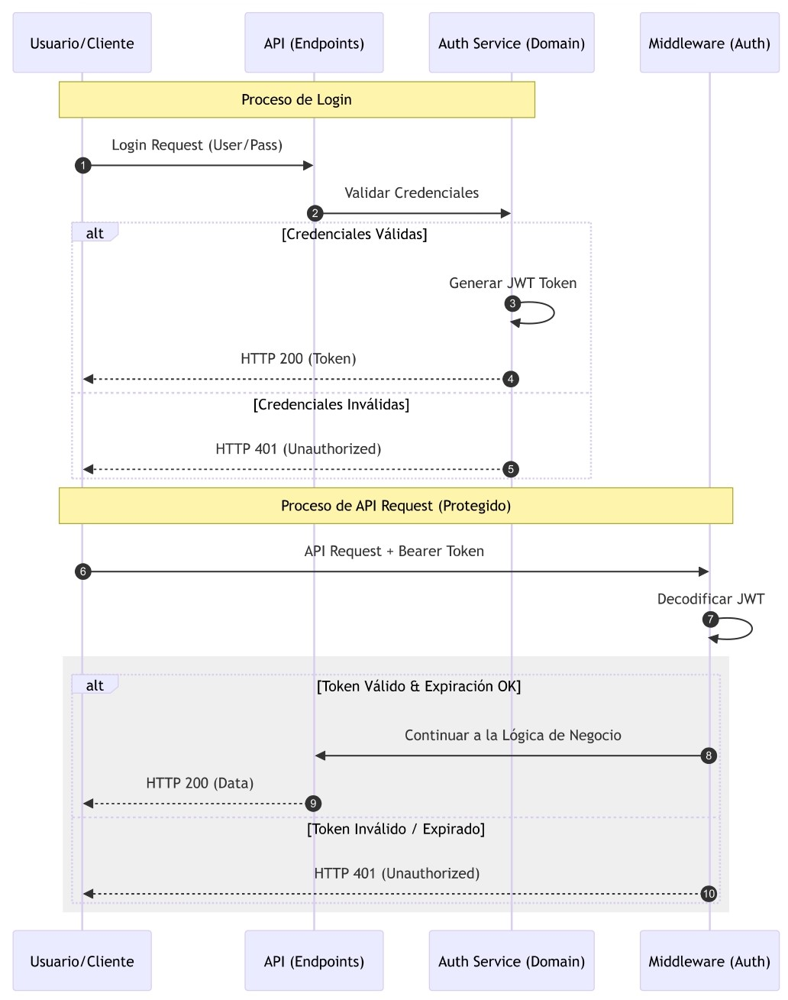

# Arquitectura del Sistema

## Documento de Diseño Arquitectonico

**Proyecto:** Sistema Backend - Gestion de Productos, Ordenes y Reportes de Ventas

**Fecha:** 14 de febrero de 2026

**Autor:** Jamid Stiven Villarreal Rugeles

**Arquitectura:** Hexagonal (Ports & Adapters)

## Requerimientos Técnicos

**Lenguaje:** Python

**Framework:** FastAPI

**Base de datos:** PostgreSQL

**ORM:** SQLAlchemy

**Redis:** redis

**Validaciones:** Pydantic

**Manejo correcto de errores HTTP**

**Control de transacciones**

---

## Tabla de Contenidos

1. Diagrama de Flujo del Sistema
2. Componentes Principales
3. Justificacion del Stack Tecnologico
4. Flujo de Creacion de Ordenes
5. Uso de Redis
6. Estrategia de Escalabilidad

---

## 1. Diagrama de Flujo del Sistema

### 1.1 Arquitectura general



### 1.2 Flujo de una Request HTTP



## 2. Componentes Principales

### 2.1 API Backend (FastAPI)

FastAPI actua como el adaptador primario de entrada en la arquitectura hexagonal.

#### Estructura Hexagonal del proyecto

```text
app/
├── main.py                          # Entry point
├── api/                             # ADAPTERS IN
│   ├── v1/endpoints/
│   │   ├── products.py
│   │   ├── orders.py
│   │   └── reports.py
│   ├── dependencies.py              # Inyeccion de dependencias
│   └── middleware/
│       ├── rate_limiter.py
│       ├── logging_middleware.py
│       └── error_handler.py
├── domain/                          # NUCLEO DEL HEXAGONO
│   ├── models/
│   │   ├── product.py
│   │   └── order.py
│   ├── services/
│   │   ├── product_service.py
│   │   ├── order_service.py
│   │   └── report_service.py
│   ├── ports/outbound/
│   │   ├── product_repository_port.py
│   │   ├── order_repository_port.py
│   │   └── cache_port.py
│   └── exceptions.py
├── infrastructure/                  # ADAPTERS OUT
│   ├── database/
│   │   ├── connection.py
│   │   ├── models/
│   │   └── repositories/
│   └── cache/
│       ├── redis_client.py
│       └── redis_cache_adapter.py
├── schemas/                         # Pydantic DTOs
└── core/
    ├── config.py
    └── logging.py
```

#### Responsabilidades de cada capa

| Capa                             | Responsabilidad                                   | Depende de              |
| -------------------------------- | ------------------------------------------------- | ----------------------- |
| `api/` (Adapters In)             | Recibir HTTP, validar entrada, devolver responses | `domain/ports`          |
| `domain/ports/`                  | Definir contratos (interfaces abstractas)         | Nada                    |
| `domain/services/`               | Logica de negocio, reglas, orquestacion           | `domain/ports/outbound` |
| `domain/models/`                 | Entidades del negocio con invariantes             | Nada                    |
| `infrastructure/` (Adapters Out) | Acceso a datos, cache, servicios externos         | `domain/ports/outbound` |
| `schemas/`                       | DTOs de entrada/salida (Pydantic)                 | Nada                    |

**Regla de dependencia:** Las flechas siempre apuntan hacia el dominio. La infraestructura depende del dominio, nunca al reves.

### 2.2 Base de Datos Relacional (PostgreSQL)

#### Modelo Entidad-Relacion



#### Estados de una orden


### 2.3 Redis

| Funcion                | Patron de clave                | TTL    | Proposito                        |
| ---------------------- | ------------------------------ | ------ | -------------------------------- |
| **Cache de productos** | `product:{id}`                 | 5 min  | Evitar queries repetitivos       |
| **Cache de listados**  | `products:list:{skip}:{limit}` | 2 min  | Acelerar listados paginados      |
| **Cache de reportes**  | `report:{type}:{params_hash}`  | 10 min | Reportes costosos pre-calculados |
| **Rate Limiting**      | `rate:{client_ip}`             | 1 min  | Control de abuso                 |
| **Locks distribuidos** | `lock:stock:{product_id}`      | 30 seg | Concurrencia en stock            |

### 2.4 Capa de Autenticacion



## 3. Justificacion del Stack Tecnologico

TODO

## 4. Flujo de Creacion de Ordenes

TODO

## 5. Uso de Redis

TODO

## 6. Estrategia de Escalabilidad

TODO
